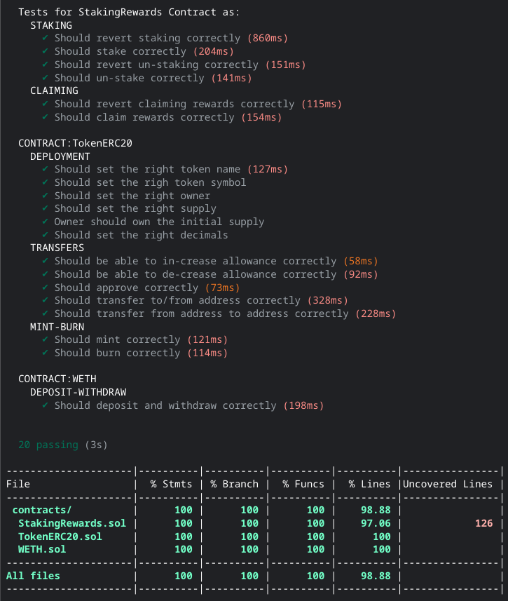

# Uniswap Liquidity Pools and Staking Contract

1. `WETH contract` tested with 100% covarage in `hardhat`- it mints `ERC20 tokens` in 1:1 ratio for native ETH currency (received by function with payable modifier) and sends native ETH currency by burning user `ERC20 tokens`. No admin exists in this contract and totalSupply() is always equal amount of ETH held by WETH smart contract.

2. `Uniswap Liquidity Pool` with token pair `WETH-TokenERC20`

3. `Staking Contract` that gives an income of 1 token every week per specific amount of LP tokens (e.g. 1 token every week per 100 LP tokens given by Uniswap V2).

- `TokenERC20` Deployed and Verified on [goerli](https://goerli.etherscan.io/address/0xa883d9C6F7FC4baB52AcD2E42E51c4c528d7F7D3#code)
- `WETH` Deployed and Verified on [goerli](https://goerli.etherscan.io/address/0x4Eec8A8176414b347d2c7a8E7254C2dAF259D70D#code)
- `StakingRewards` Deployed and Verified on [goerli](https://goerli.etherscan.io/address/0x5D9360AD6455c2Fcad0670e0491B3609D016e339#code)

- `ERC-721` published on [opensea](https://testnets.opensea.io/assets/goerli/0xb2c25d990f4fc8521ba4ca8dcd3e4800bdc61b5a/1)
- `img` published on [ipfs](https://ipfs.io/ipfs/QmZPHoUR1hy5RgrjqMp7pZXx3wFM56kB5qaMGYingfEeNS/koko.png)
- `meta` published on [ipfs](https://ipfs.io/ipfs/QmTganNHtwXxv58eedFo7F9BtzPWAXsRDhLTGM4yz8pb3t/KokoNFT.json)

- with [owner](https://sepolia.etherscan.io/address/0x741e0608906B74B8754a99413A7374FdE7B9779a)

## hardhat tasks:

- `npm install hardhat`
- `npx hardhat coverage`
- `npx hardhat run --network goerli scripts/WETH-deploy.ts`
- `npx hardhat run --network goerli scripts/staking-deploy.ts`

- `npx hardhat deposit --network goerli --amount 0.08`
- `npx hardhat MINT --amount 10000 --account 0x741e0608906B74B8754a99413A7374FdE7B9779a --network goerli`
- `npx hardhat stake --network goerli --amount 0.01 --account 0x741e0608906B74B8754a99413A7374FdE7B9779a`

## coverage

 

</a>

 
